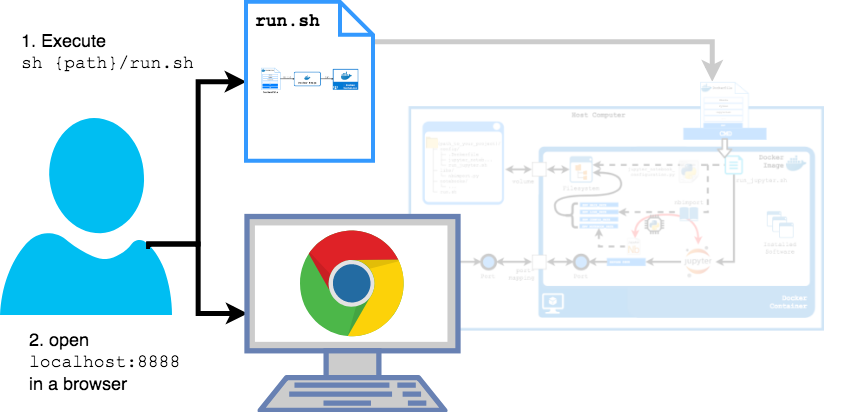

# JupyterLab-Configuration

The [JupyterLab-Configurator](https://lean-data-science.com/#/configure-jupyterlab) lets you easily create your **JupyterLab configuration** that runs JupyterLab in a **container** and automates the whole setup using **scripts**. A container is a separated environment that encapsulates the libraries you install in it without affecting your host computer. Scripts automate executing all the commands you would normally need to run manually. For you can review and edit scripts, you get full control of your configuration at any time.

**Create** your JupyterLab configuration:

1. Create your configuration with a few clicks with the [**JupyterLab-Configurator**](https://lean-data-science.com/#/configure-jupyterlab)
1. Download and unzip your configuration
1. Customize it to your needs (optional)

The following picture shows the JupyterLab configuration in action. **Use** it with two simple steps:

1. Execute `sh {path_to_your_project}/run.sh`
1. Open `localhost:8888` from a browser

<table class="image">
<tr><td></td></tr>
<tr><td class="caption" >Using the JupyterLab configuration</td></tr>
</table>